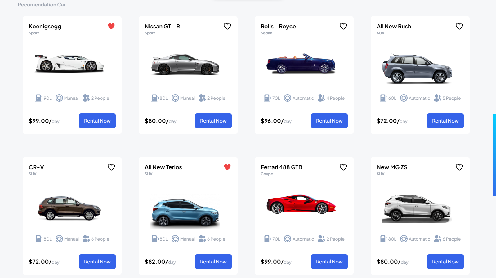
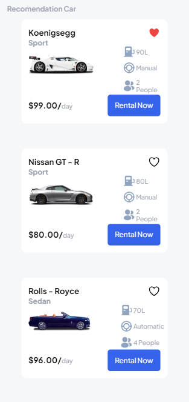

# Morent


## About the Project
Morent is car rental project where you can look in to so many different models of cars and rent the one you want with a really cheap price. This project is based on this [Figma](https://www.figma.com/design/1H0CqqHXNogN0c5E6WpEqI/Car-Rent-Website-Design---Pickolab-Studio-(Community)?node-id=1-5&p=f&t=Ruk5V5VOFYlUtEXa-0) design.  
I've used React + TailwindCss for this project.

## Features
- Completely responsive in every viewpoint
- The ability to sort all the cars by type , capacity and price
- dynamic data base

## Screenshots
 
<p align="center">
  
</p>


## Made By Seyed Ali Najafi
[Live Website](https://mizan-app.ir)  
[Portfolio](https://seyedalinajafi.ir)


## Installation
```bash
git clone https://github.com/your-username/your-repo.git](https://github.com/SeyedAliNajafi/Morent
cd Morent
npm install
npm start devx


